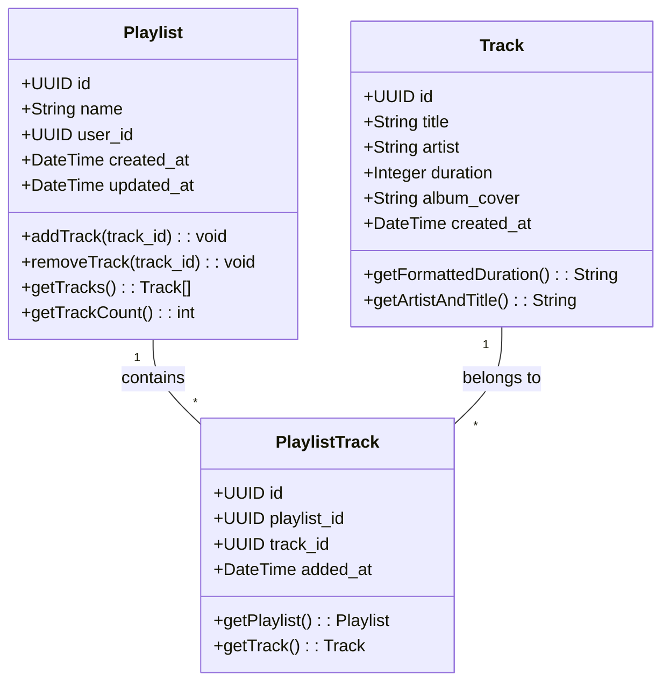
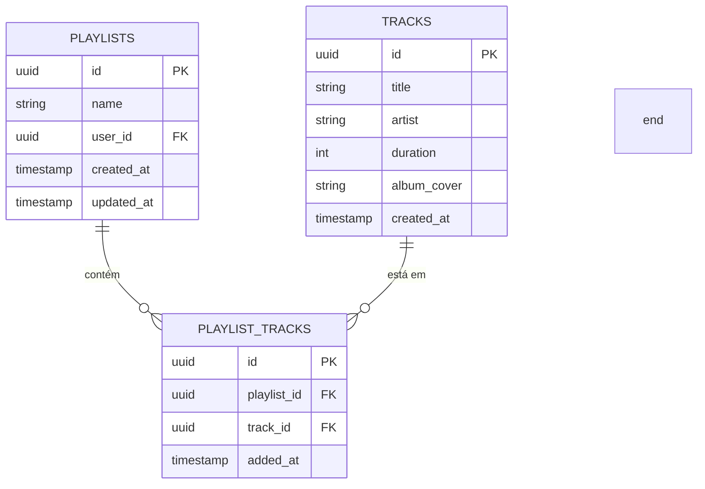

# Plataforma de Streaming de Música

Uma plataforma completa de streaming de música com frontend em Next.js e backend em Node.js/Express.

## 🚀 Estrutura do Projeto

\`\`\`
music-streaming-platform/
├── frontend/          # Next.js frontend
│   ├── app/          # App Router pages
│   ├── components/   # React components
│   └── lib/          # Utilities
├── backend/          # Node.js/Express API
│   ├── src/
│   │   ├── routes/   # API routes
│   │   ├── middleware/ # Express middleware
│   │   └── types/    # TypeScript types
└── package.json      # Root package.json
\`\`\`

## 🛠️ Instalação

### Pré-requisitos
- Node.js 18+
- npm ou yarn
- Conta no Supabase

### Configuração

1. **Clone o repositório e instale as dependências No front:**
\`\`\`bash
cd frontend
npm install
\`\`\`
1. **Clone o repositório e instale as dependências No front:**
\`\`\`bash
cd backend
npm install
\`\`\`

2. **Configure o Supabase:**
   - Crie um projeto no [Supabase](https://supabase.com)
   - Execute o script SQL fornecido para criar as tabelas
   - Configure as variáveis de ambiente

3. **Configure as variáveis de ambiente:**
ACESSAR A DOCUMENTAÇÃO ENVIADA PARA ACESSAR AS .ENVS

## 🚀 Executando o Projeto

### Executar separadamente
# Frontend (porta 3000)
1. cd frontend
2. npm run dev

# Backend (porta 3001)
1. cd backend
2. npm run dev

## 📚 API Endpoints

### Autenticação
- `POST /api/auth/register` - Registrar usuário
- `POST /api/auth/login` - Fazer login
- `POST /api/auth/logout` - Fazer logout

### Faixas
- `GET /api/tracks` - Listar faixas
- `GET /api/tracks/:id` - Buscar faixa por ID
- `POST /api/tracks` - Criar nova faixa (autenticado)

### Playlists
- `GET /api/playlists` - Listar playlists do usuário (autenticado)
- `POST /api/playlists` - Criar playlist (autenticado)
- `POST /api/playlists/:id/tracks` - Adicionar faixa à playlist (autenticado)
- `DELETE /api/playlists/:id/tracks/:trackId` - Remover faixa da playlist (autenticado)
- `DELETE /api/playlists/:id` - Deletar playlist (autenticado)

## 🔧 Tecnologias Utilizadas

### Frontend
- Next.js 14 (App Router)
- React 18
- TypeScript
- Tailwind CSS
- Supabase
- shadcn/ui
-  Jtest

### Backend
- Node.js
- Express.js
- TypeScript
- Supabase (Database)
- SwaggerAPI
- CORS, Helmet, Morgan

## EXTRA API TAYLOR SWIFT
- Integração com api da taylor swift
\`\`\`bash
https://bump.sh/sarbor/doc/taylor-swift-api/operation/operation-get-songs-parameter
\`\`\`

## Banco de dados
**Diagrama de Classes:**

**Diagrama ER:**

## 📱 Funcionalidades

- ✅ Autenticação completa (registro/login/logout)
- ✅ Listagem e busca de faixas
- ✅ Criação e gerenciamento de playlists
- ✅ Adição/remoção de faixas em playlists
- ✅ Interface responsiva
- ✅ API RESTful completa
- ✅ Proteção de rotas
- ✅ Validação de dados

## 🚀 Deploy

### Frontend (sugestão: Vercel)
\`\`\`bash
cd frontend
npm run build
\`\`\`

### Backend (sugestão: Railway/Heroku)
\`\`\`bash
cd backend
npm run build
npm start

